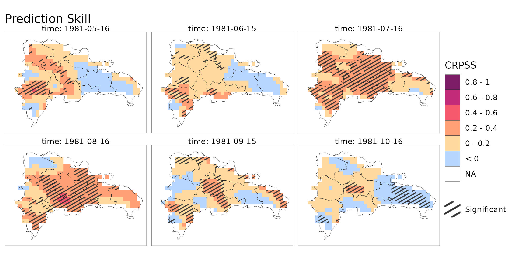

# clim4health: an R package to harmonise climate datasets for health impact studies
 <a href='https://www.bsc.es/es'></a> <a href='https://www.bsc.es/es'></a>

***

<!-- badges: start -->
[](https://doi.org/10.5281/zenodo.22141612)
[](LICENSE.md)
<!-- badges: end -->
<br>

## Overview

This repository contains the analysis code and results of the tools paper *clim4health: an R package to harmonise climate datasets for health impact studies* by Emily Ball, Alba Llabrés-Brustenga, Carles Milà Garcia, Rebeca Nunes Rodrigues, Daniela Lührsen, and Rachel Lowe. The article is in review at *Wellcome Open Research*.

*clim4health* is an R package designed to obtain, transform and export climate data for their use in epidemiological analyses and other types of applications. The package contains a series of functions structured in three sequential blocks: input, transformation, and output.

© 2026 BSC. The content of this repository is licensed under [GPL3](LICENSE).

<div align="center">
</center>
<p> CRPSS of a downscaled temperature forecast over the Dominican Republic, generated using clim4health. Figure 8 of the manuscript. </p>
</div>


## Usage and dependencies

To access the repository, please download it as a zip file using the gitlab interface or clone it using the following *git* command:

```bash
git clone https://gitlab.earth.bsc.es/ghr/clim4health-paper.git
```

(dependencies - R) We used R version 4.4.1 with the following packages: clim4health (https://cran.r-project.org/web/packages/clim4health/), devtools (https://cran.r-project.org/web/packages/devtools/), sf (https://cran.r-project.org/web/packages/sf/), ggplot2 (https://cran.r-project.org/web/packages/ggplot2/), cowplot (https://cran.r-project.org/web/packages/cowplot/), tidyr (https://cran.r-project.org/web/packages/tidyr/), dplyr (https://cran.r-project.org/web/packages/dplyr/), patchwork (https://cran.r-project.org/web/packages/patchwork/), tibble (https://cran.r-project.org/web/packages/tibble/).

(computing - Hub) All scripts were executed on a remote machine with 16 cores and 32 GB of RAM.

## Repository structure

Scripts should be run in the order indicated by the two first script digits. The structure of the repository is as follows:

<pre lang="markdown">
<b>clim4health-paper/</b>
│
├── R/                           
│   ├── 00_utils.R                                 # Analysis functions
│   ├── 01_download_Colombia.R                     # Download data
│   ├── 02_calibrate_Colombia.R                    # Calibrate
│   ├── 03_calibrate_Colombia_esarchive.R          # Calibrate using data from esarchive (internal)
│   ├── 04_download_DominicanRepublic.R            # Download data
│   ├── 05_downscale_DominicanRepublic.R           # Downscale 
│   ├── 06_downscale_DominicanRepublic_esarchive.R # Downscale using data from esarchive (internal)
│   ├── 07_download_Brazil.R                       # Download data
│   ├── 08_station_to_s2dv_Brazil.R                # Transform station data
│   ├── 09_validate_Brazil.R                       # Compare station to ERA5-Land
│   ├── 10_downscale_Brazil_fcst.R                 # Downscale forecast
│   └── clean_scripts/
│       ├── *.Rmd                                  # To create Figs S3, S4, S5, S7
│       └── convert_to_jpg.R                       # Convert pdf to jpg (Figs S3, S4, S5, S7)
│
├── data/
│    ├── raw/                # Project-specific raw data
│    ├── preprocessed/       # Folder where preprocessed data is stored
│    └── analysis/           # Folder where analysis-ready data is stored  
│
├── figures/                 # Figures included in the publication
│
└── results/                 # Final results of the analysis to be shared
</pre>

Additional files (license, gitignore, README, etc.) are included in the repository root.


## Data

Reanalysis and seasonal forecast data used for the analysis within this manuscript are freely available from the Copernicus Climate Data Store and were accessed using clim4health. Station data from Patos, Paraíba, Brazil were extracted from https://bdmep.inmet.gov.br/.

Please contact the authors (emily.ball@bsc.es) to gain access to the processed data.


## Contributors

**[Emily Ball, PhD](https://www.bsc.es/ball-emily)**
<a href="https://orcid.org/0000-0002-3002-4068" style="margin-left: 15px;"></a>\
Barcelona Supercomputing Center\
Climate Services Team

**Alba Llabrés, PhD**
<a href="https://orcid.org/0000-0003-2144-675X" style="margin-left: 15px;"></a>\
Barcelona Supercomputing Center\
Climate Services Team

**[Carles Milà, PhD](https://www.bsc.es/mila-garcia-carles)**
<a href="https://orcid.org/0000-0003-0470-0760" style="margin-left: 15px;"></a>\
Barcelona Supercomputing Center\
Global Health Resilience

**[Rebeca Nunes, MSc](https://www.bsc.es/es/nunes-rodrigues-rebeca)** 
<a href="https://orcid.org/0009-0009-8738-0985" style="margin-left: 15px;"></a>\
Barcelona Supercomputing Center\
Earth Data and Diagnostics

**[Daniela Lührsen, MSc](https://www.bsc.es/luhrsen-daniela-sofie)**
<a href="https://orcid.org/0009-0002-6340-5964" style="margin-left: 15px;"></a>\
Barcelona Supercomputing Center\
Global Health Resilience

**[Rachel Lowe, PhD](https://www.bsc.es/lowe-rachel)**
<a href="https://orcid.org/0000-0003-3939-7343" style="margin-left: 15px;"></a>\
Barcelona Supercomputing Center\
Global Health Resilience (Group leader)

***