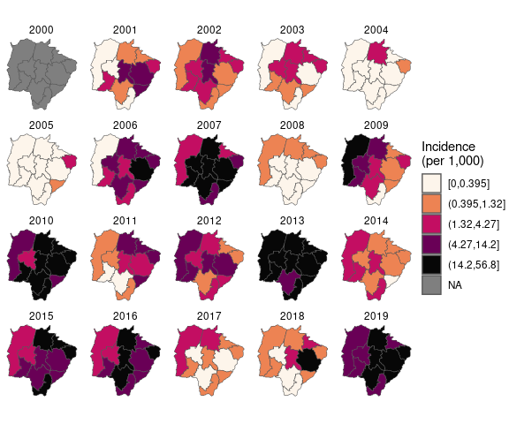
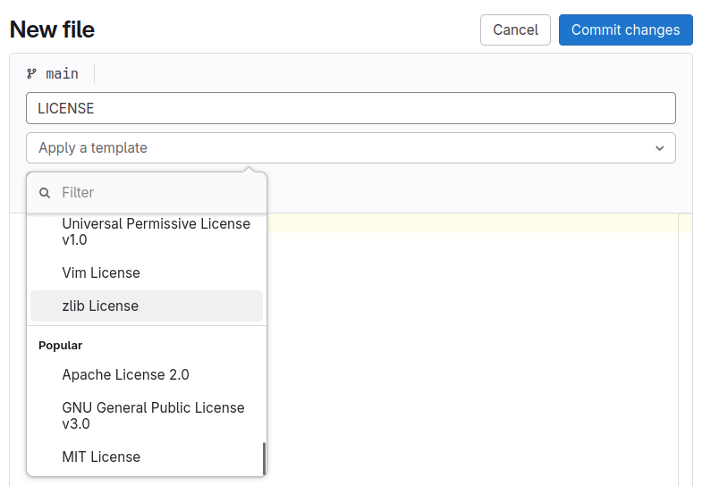

# Placeholder study title <a href='https://www.bsc.es/es'></a> <a href='https://www.bsc.es/es'></a>

<!-- badges: start -->
[](https://doi.org/10.1002/sim.5549)
[](LICENSE.md)
<!-- badges: end -->
<br>

(add additional logos and update DOI in badge)

***

## Overview

(Intro) This repository contains the analysis code and results of the study/analysis *Placeholder study title* by C. Milà, D. Lührsen, E. Roberts, and R. Lowe. The article has been published in the journal *Placeholder journal* and it is openly available at [placeholder link](https://doi.org/10.1002/sim.5549). A preprint of the article is available at [placeholder link](https://doi.org/10.1002/sim.5549).

(Brief description of the study) Previous studies demonstrate statistically significant associations between disease and climate variations, highlighting the potential for developing climate-based epidemic early warning systems. However, limitations include failure to allow for non-climatic confounding factors, limited geographical/temporal resolution, or lack of evaluation of predictive validity. Here, we consider such issues for dengue in Southeast Brazil using a spatio-temporal generalised linear mixed model with parameters estimated in a Bayesian framework, allowing posterior predictive distributions to be derived in time and space.

(Copyright and license) © 2026 BSC. The content of this repository is licensed under [GPL3](LICENSE) (please check FAQs below if you want to change it).

(summary figure)

<div align="center">
</center>
<p> Example plot from the project. </p>
</div>


## Usage and dependencies

(cloning) To access the repository, please download it as a zip file using the gitlab interface or clone it using the following *git* command:

```bash
git clone https://gitlab.earth.bsc.es/ghr/yourproject.git
```

(dependencies - R) We used R version XX with the following packages: [lubridate](https://cran.r-project.org/web/packages/lubridate/index.html), [GHRexplore](https://cran.r-project.org/web/packages/GHRexplore/index.html) and [sf](https://cran.r-project.org/web/packages/sf/index.html).

(dependencies - python)  We used python version XX with the following packages: [pandas](https://pypi.org/project/pandas/), [rasterio](https://pypi.org/project/rasterio/) and [socio4health](https://pypi.org/project/socio4health/).

(environment - Docker) A Docker container was used to run this analysis. Please use the [Docker file](Dockerfile) included in this repository to build it.

(environment - Conda) A conda environment was used to run this analysis. Please access the [environment file](environment.yml) to create it.

(environment - renv) A renv reproducible environment is included in this repository. Please check the [renv documentation](https://rstudio.github.io/renv/articles/renv.html) to see how to use it.

(computing - local) Scripts 01–04 were executed on a local Windows/Ubuntu machine with XX CPU cores and XX GB of RAM.

(computing - HPC) Scripts 01–04 were executed on an HPC system using a CPU/GPU node with XX cores and XX GB of RAM.

(computing - Hub) Scripts 01–04 were executed on an remote machine with 16 cores and 32 GB of RAM.

## Repository structure

(structure) Scripts should be run in the order indicated by the two first script digits. The structure of the repository is as follows:

<pre lang="markdown">
<b>projecttitle/</b>
│
├── R/                           
│   ├── 00_utils.R          # Analysis functions      
│   ├── 01_preprocessing.R  # Data pre-processing  
│   └── 02_analysis.R       # Statistical analysis
│
├── python/      
│   ├── 00_utils.py         # Analysis functions     
│   ├── 01_preprocessing.py # Data pre-processing    
│   └── 02_analysis.py      # Statistical analysis
│
├── Rmd/                           
│   ├── 01_main.Rmd         # Main figures and tables  
│   └── 02_appendix.Rmd     # Appendix figures and tables   
│
├── jupyter/                           
│   ├── 01_main.ipynb       # Main figures and tables          
│   └── 02_appendix.ipynb   # Appendix figures and tables    
│
├── data/
│    ├── raw/                # Project-specific raw data
│    ├── preprocessed/       # Folder where preprocessed data is stored
│    └── analysis/           # Folder where analysis-ready data is stored  
│
├── figures/                 # Figures included in the publication
│
└── results/                 # Final results of the analysis to be shared
</pre>

Additional files (license, gitignore, README, etc.) are included in the repository root.


## Data

(published) Data are openly available in a [Zenodo repository](https://zenodo.org/records/4632205).

(authors) Please contact the authors (youremail@bsc.es) to gain access to the anonymised analysis-ready data.


## Contributors

**[Carles Milà](https://www.bsc.es/mila-garcia-carles)**
<a href="https://orcid.org/0000-0003-0470-0760" style="margin-left: 15px;"></a>\
 Barcelona Supercomputing Center (BSC), Spain

**[Daniela Lührsen](https://www.bsc.es/luhrsen-daniela-sofie)**
<a href="https://orcid.org/0009-0002-6340-5964" style="margin-left: 15px;"></a>\
 Barcelona Supercomputing Center (BSC), Spain

**[Emma Roberts](https://www.bsc.es/roberts-emma)**\
Barcelona Supercomputing Center (BSC), Spain

**[Rachel Lowe](https://www.bsc.es/lowe-rachel)**
<a href="https://orcid.org/0000-0003-3939-7343" style="margin-left: 15px;"></a>\
Barcelona Supercomputing Center (BSC), Spain \
Catalan Institution for Research and Advanced Studies (ICREA), Spain

***


## FAQs

**Please delete this section in your repo, for internal use only.**

* How should I use this template?

The general idea is to get a copy of this template as a starting point for your future repository (e.g. *myproject*). Unfortunately, the Earth Sciences gitlab version we have doesn't support templates so we have to do it using git commands. Please don't create the repo on gitlab using the online gitlab GUI since the git commands will do it for you. To do it, you have two options, either you ask one of the data scientists to do it for you, or do it yourself by following these steps:

1. Make a shallow clone of this template to your path of choice (e.g. *mypath*).
2. Clean the git history and make a first commit with the template.
3. Change the remote to the name of the repo you want to have on the GHR gitlab (e.g. *myproject*).
4. Push it.

These are the git commands to do it:

```bash
cd mypath
git clone --depth 1 https://gitlab.earth.bsc.es/ghr/GHRtemplate.git myproject
cd myproject
rm -rf .git
git init -b main
git add .
git commit -m "Initial commit"
git remote add origin https://gitlab.earth.bsc.es/ghr/myproject.git
git push -u origin main
```

Now you can go to your remote repository on gitlab and you'll be able to see the template. A good second step would be adapting the README to your project and deleting the files you won't be using (e.g. if using R, delete `python` and `jupyter` folders).


* Where and how should I store my data?

All data should be ideally stored in the `shared` folder and it is strongly encouraged to work in there via the Hub or MN5. We have defined the following structure for the data folder:

<pre lang="markdown">
<b>projecttitle/</b>
│
├── data/
│    ├── raw/                # Project-specific raw data
│    ├── preprocessed/       # Folder where preprocessed data is stored
│    └── analysis/           # Folder where analysis-ready data is stored  
│
└── results/                 # Final results of the analysis to be shared
</pre>

The data types are the following:
1. Raw: Raw data specific to the project. Remember that climate data are stored in `esarchive`. These data should not be commited.
2. Preprocessed: Preprocessed (e.g. clean, aggregated, transformed) data. These data should generally not be commited.
3. Analysis: Analysis-ready data. These data might be commited.

Moreover, there is the `results/` folder, where analysis outputs such as tables, model outputs, simulations etc. should be placed. These might or might not be commited.

* How should my scripts and files be named?

Please use file names with no spaces, use underscores instead. All scripts should start with two numbers (see examples) so that the order they should be executed is clear. Keep script 00_ for your own functions.

* Should I use all the files included in this template?

No, only keep those that are relevant to your analysis and the tools you used. This template intends to cover as many situations as possible so including eveything contained in here is highly unlikely.

* What metadata should I include in my scripts?

In this repo you'll find examples of header for R, python, Rmd and jupyter notebook files with the metadata to be included.

* Should my analysis be in a new repo or should it be a branch of an existing one?

Every analysis should have its own distinct repo. Branching and forking should be reserved for (collaborative) editing of that same analysis. If you are working in a project that has different analysis, we can open a subgroup to store them in a tidy manner. Ask a GHR data scientist and we'll get in touch with Albert to make it happen!

* Should I commit my data?

Commiting large files is not a good idea, since it increases the repository size and might cause instability and long cloning times. Always try to keep the repo size below 500MB. Moreover, you might be commiting confidential information without realising it! A good way to ensure you're not commiting any data is to use wildcards in the [.gitignore](.gitignore) file in the root of you repo, e.g. avoid commiting any data and especially netCDF files, or html reports:

```
data/raw/*
data/preprocessed/*
data/analysis/*
results/*
*.nc
*.html
```

As a general guideline, you should only commit final results that you want to share (e.g. input data to build figures and tables) and you should refrain from commiting any data. Once you have the final results and have decided what you want to share, please edit the `.gitignore` file to start tracking of them.

* What if my script structure is more complex? 

Feel free to adapt the repo structure to your own needs! For example, you might have climate data processing and statistical analysis,
so a structure like this could be good for you:

<pre lang="markdown">
<b>projecttitle/</b>
│
└── R/                           
    ├── climate/             
    │   ├── 00_clim_utils.R         
    │   ├── 01_clim_clean.R      
    │   ├── 02_clim_aggregate.R 
    │   └── 03_clim_index.R   
    │
    └── analysis/      
        ├── 00_stats_utils.R         
        ├── 01_unimod.R 
        └── 02_multimod.R 
</pre>

Likewise, feel free to organise your notebooks as you see fit!

* What license should I use?

The chosen license will depend upon the dependencies of the project. For R-based projects using GHRtools, the default GPLv3 license included in the repo is generally a good defoption provided that none of the other packages you are using has a GPL v2 license. You can change the license type (remember to also update the badge) by deleting the [LICENSE](LICENSE) file, and creating a new one from gitlab as follows:

<div align="center">
</center>
</div>


* Should I use this template if I'm building a package?

The structure of a package is quite different from an analysis repository. Please have a look at one of the GHRtools package repositories to have an idea of how it should be structured.


* How should I track the versions of the packages used?

You have different options. At minimum, fill in the dependency section of the README following this template. If you want to provide a safer environment, there are more options, including conda, docker, o renv (if only R is used). Check with a GHR data scientist if you're interested in one of these options!